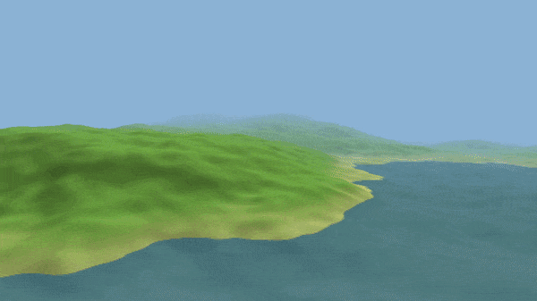

<h1 align="center">Terrain Generation</h1>
<p align="center">An infinite procedural terrain renderer in C++20 with OpenGL and SDL3, featuring chunk streaming, dynamic day/night cycle, and water.</p>
<p align="center">  </p>

## Features

- **Procedural Terrain** — Perlin Noise with 8 octaves generating natural-looking infinite terrain
- **Infinite Chunks** — chunk-based world streamed on a background thread with zero frame lag
- **Dynamic Day/Night** — sun position, sky color and light color change in real time
- **Water** — translucent ocean with fog blending
- **Atmospheric Fog** — distance fog matches sky color for seamless horizon
- **Free Camera** — WASD + mouse look, sprint with shift
- **Biome Shading** — sand, grass, rock and snow zones blended with slope-aware smoothstep

## Controls

| Input | Action |
|---|---|
| `W A S D` | Move camera |
| `Space` | Move up |
| `LCtrl` | Move down |
| `LShift` | Sprint |
| `Mouse` | Look around |
| `Escape` | Release mouse / Quit |

## Building

**Dependencies:**
- CMake 3.20+
- SDL3
- SDL3_ttf
- OpenGL 3.3+
- GLM
- spdlog

```bash
git clone https://github.com/JJ0o0/TerrainGeneration
cd TerrainGeneration
cmake -B build
cmake --build build
./build/app
```

## Project Structure

```
TerrainGeneration/
├── assets/
│   ├── fonts/
│   └── shaders/
│       ├── terrain.vert / terrain.frag
│       └── water.vert   / water.frag
├── include/TerrainGeneration/
│   ├── core/
│   │   └── App.hpp           # Main application loop
│   ├── graphics/
│   │   ├── Camera.hpp        # View and projection matrices
│   │   ├── Chunk.hpp         # Single terrain chunk (generate + upload)
│   │   ├── ChunkManager.hpp  # Chunk streaming with background thread
│   │   ├── Mesh.hpp          # VAO/VBO/EBO wrapper
│   │   ├── Shader.hpp        # GLSL shader with templated uniforms
│   │   ├── Vertex.hpp        # Vertex struct (position, normal, texcoord)
│   │   └── Water.hpp         # Water plane
│   └── utilities/
│       ├── Colors.hpp        # Sky and light color constants
│       ├── Input.hpp         # Keyboard state helper
│       ├── Log.hpp           # spdlog wrapper
│       └── Random.hpp        # Float RNG utilities
└── src/
    ├── core/App.cpp
    ├── graphics/
    │   ├── Camera.cpp
    │   ├── Chunk.cpp
    │   ├── ChunkManager.cpp
    │   ├── Mesh.cpp
    │   ├── Shader.cpp
    │   └── Water.cpp
    └── main.cpp
```

## Architecture

`ChunkManager` owns the world — it keeps a hash map of active `Chunk` pointers and streams new ones via a background `std::thread`. Chunk geometry is generated off the main thread and uploaded to the GPU via `uploadToGPU()` on the next frame. `Chunk` samples a multi-octave Perlin heightmap using a global seed so adjacent chunks stitch seamlessly. `Shader` compiles GLSL from disk and exposes a templated `setUniform` with explicit specializations for `float`, `int`, `glm::mat4` and `glm::vec3`. `Camera` is a plain struct with `getView()` and `getProjection()` helpers. `App` drives the game loop, owns all graphics objects, and runs the day/night cycle by rotating the light direction and interpolating sky and fog colors each frame.

## License

[MIT](LICENSE)